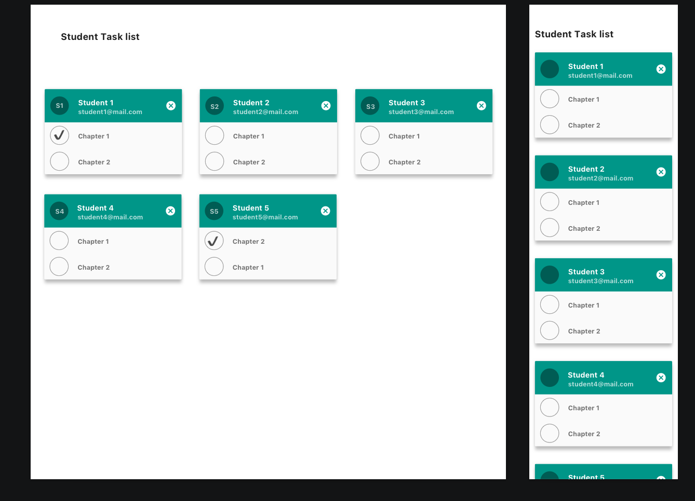

# Task
**\
Angular Frontend Task: Student List**

**Description:**

The goal of this task is to create a fully responsive web app to show a list of students as cards.

**Goals:**

1.  Display a grid of student cards, one for each student (as shown in the mockup)
2.  Show which of the tasks a student has completed and how many to go

**Requirements:**

1.  Make use of the latest Angular framework or use this example project as a base
2.  Use npm packages as needed, but think about consequences
3.  Store the ticked tasks in the browsers local storage
4.  Make sure, that the tasks which are completed show above the incomplete tasks
5.  Make use of Git to version control each piece of work
6.  Add/edit a README file to the root of the project containing any relevant information about your code (e.g. packages used, build instructions, etc).
7.  Have Fun!

**Evaluation Criteria**

1.  Follow clean code practices and SOLID principles
2.  Good usage of Design Patterns and Object Oriented Programming
3.  Well-architected code with clear separation of responsibilities
4.  Good usage of version control system

It is intentionally open in some aspects, feel free to show off your creativity and skills by designing a high quality web app.

**Mockup**

**Handoff**

Send the repository via Email to Dimitry, our recruiting specialist.

By performing this task you acknowledge that this is a voluntary skill assessment test provided by ecoreps. and NO compensation will be provided for it.

# Studenttasks

This project was generated with [Angular CLI](https://github.com/angular/angular-cli) version 12.1.2.

## Development server

Run `ng serve` for a dev server. Navigate to `http://localhost:4200/`. The app will automatically reload if you change any of the source files.

## Code scaffolding

Run `ng generate component component-name` to generate a new component. You can also use `ng generate directive|pipe|service|class|guard|interface|enum|module`.

## Build

Run `ng build` to build the project. The build artifacts will be stored in the `dist/` directory.

## Running unit tests

Run `ng test` to execute the unit tests via [Karma](https://karma-runner.github.io).

## Running end-to-end tests

Run `ng e2e` to execute the end-to-end tests via a platform of your choice. To use this command, you need to first add a package that implements end-to-end testing capabilities.

## Further help

To get more help on the Angular CLI use `ng help` or go check out the [Angular CLI Overview and Command Reference](https://angular.io/cli) page.
